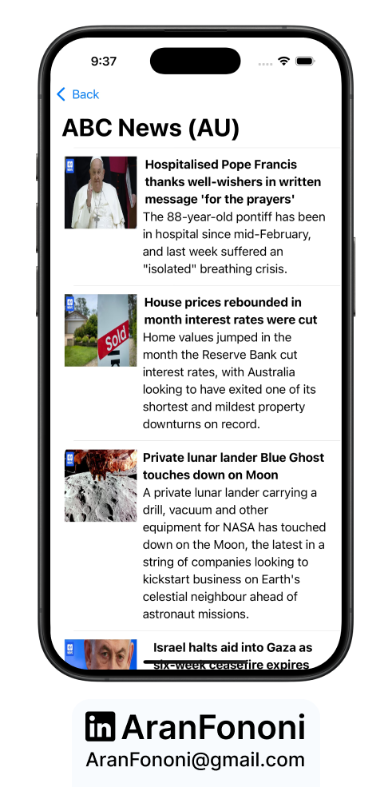

# Async News iOS APP 📰⚡️

### Asynchronous News Fetching with Swift Concurrency  

The **NewsApp** is an iOS project built using SwiftUI and Swift Concurrency (Async/Await, GCD). Originally a course challenge, this project was taken a step further by fully implementing async data fetching, making API calls more efficient, and improving overall responsiveness. The app fetches news from different sources and displays the latest articles in a clean SwiftUI interface.  

## Project Overview  
This project focuses on modern concurrency techniques in Swift, replacing traditional completion handlers with async/await for a more structured and readable approach. The app communicates with the [NewsAPI.org](https://newsapi.org/) service to fetch real-time news updates.  

⚠️ **Note:** To run this project, replace `YOURAPIKEY` in `Constants.swift` with your own API key from NewsAPI.org.  

## Learning Outcomes  
- **Swift Concurrency**: Implemented async/await to manage API calls efficiently.  
- **Grand Central Dispatch (GCD)**: Used `DispatchQueue.main.async` to update the UI correctly.  
- **MVVM Architecture**: Applied MVVM principles to separate business logic from UI.  
- **SwiftUI Best Practices**: Built a clean and scalable UI using SwiftUI.  

## Key Skills  
- Swift Concurrency (Async/Await)  
- Grand Central Dispatch (GCD)  
- API Integration & Network Calls  
- SwiftUI UI Development  
- MVVM Architectural Pattern  

## Features  
✅ Fetch news sources asynchronously  
✅ Display latest articles with images  
✅ Pull-to-refresh functionality  
✅ Fully async network requests using `URLSession`  

---

### Image Placeholder  
  

---

## Usage  
1. Clone the repository.  
2. Open `Constants.swift` and **replace `YOURAPIKEY` with your NewsAPI.org API key**.  
3. Run the project on Xcode (iOS 16+ recommended).  

---

## Contact
For more information, feel free to reach out:  
- **Email**: [aranfononi@gmail.com](mailto:aranfononi@gmail.com)  
- **LinkedIn**: [Aran Fononi](https://www.linkedin.com/in/aran-fononi-18182b265)
